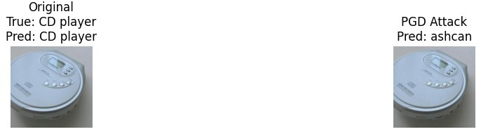
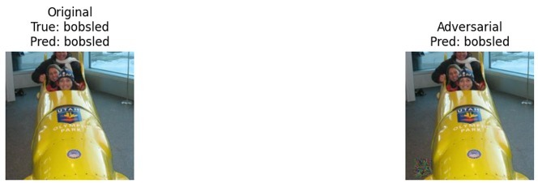

# Adversarial Vulnerabilities in Deep Image Classifiers

### A study on ResNet-34 and DenseNet-121

How easily can a state-of-the-art image classifier be fooled? This project answers
that question empirically. I implement three adversarial attacks — **FGSM**, **PGD**,
and a **localized patch attack** — against a pretrained **ResNet-34**, measure how
much each degrades accuracy, and then test whether those same adversarial images
**transfer** to a completely different architecture, **DenseNet-121**.

The headline finding: a **PGD attack with perturbations too small for a human to
see** (L∞ ≤ 0.02) collapses ResNet-34's Top-1 accuracy from **76.0% to 0.2%** — and
the *exact same* perturbations, never tuned for DenseNet-121, still knock ~14 points
off that model too. Adversarial examples don't just break one model; they expose
weaknesses shared across convolutional networks.

📄 **Full research paper:** [`report/Adversarial_Vulnerabilities_Report.pdf`](report/Adversarial_Vulnerabilities_Report.pdf)
&nbsp;·&nbsp; 👩‍💻 **Authors:** Rohan Dhengale, Monish Raman Vishakraman (NYU)

---

## Table of contents

- [Background: what is an adversarial attack?](#background-what-is-an-adversarial-attack)
- [The three attacks](#the-three-attacks)
- [Results at a glance](#results-at-a-glance)
- [Visual results](#visual-results)
- [Transferability: do attacks fool a different model?](#transferability-do-attacks-fool-a-different-model)
- [What I learned](#what-i-learned)
- [Project structure](#project-structure)
- [How it works (implementation notes)](#how-it-works-implementation-notes)
- [Getting started](#getting-started)
- [References](#references)

---

## Background: what is an adversarial attack?

Deep neural networks achieve human-level accuracy on image classification — yet they
can be fooled by perturbations so small they're invisible to people. An **adversarial
attack** computes a tiny, deliberate change to the pixels of an image that pushes the
model toward a wrong prediction, while the image looks unchanged to us.

This matters well beyond the lab: the same idea underlies adversarial stickers that
mislead self-driving cars and patches that defeat face recognition. Understanding how
and *why* these attacks work is the first step toward building models that resist them.

**Experimental setup**

- **Source model:** ResNet-34, pretrained on ImageNet-1K (the "white-box" target the attacks are crafted against).
- **Transfer model:** DenseNet-121, pretrained on ImageNet-1K (a "black-box" target the attacks were *not* designed for).
- **Data:** a curated subset of ImageNet-1K — 500 images across 100 classes.
- **Constraint:** all attacks are bounded in the **L∞ norm**, i.e. no single pixel may change by more than ε. This is the standard way to keep perturbations "imperceptible."

---

## The three attacks

| Attack | Type | Intuition |
|--------|------|-----------|
| **FGSM** (Fast Gradient Sign Method) | Single-step, whole image | Take one step in the direction that most increases the model's loss. Fast but coarse. |
| **PGD** (Projected Gradient Descent) | Iterative, whole image | Repeat FGSM in small steps, re-projecting back into the ε-ball each time. Explores the loss landscape thoroughly — the strongest attack here. |
| **Patch** | Iterative, localized | Restrict all perturbation to a small 32×32 square (like a real-world sticker), optimized toward a wrong target class. |

The math for each:

```
FGSM:   x_adv = x + ε · sign(∇ₓ L(x, y))

PGD:    δ_{t+1} = Clip_ε( δ_t + α · sign(∇ₓ L(x + δ_t, y)) )       # α = ε/10, 20 iterations

Patch:  minimize L(x + P, y_target)  s.t. P supported only on a 32×32 region
```

---

## Results at a glance

### Attacks on ResNet-34 (white-box — crafted directly against this model)

| Attack | Budget (ε) | Top-1 | Top-5 | Top-1 drop | Speed |
|--------|-----------|-------|-------|------------|-------|
| Baseline (clean) | — | **76.00%** | 94.20% | — | — |
| FGSM | 0.02 | 11.40% | 37.60% | −64.60 pp | 8.61 it/s (fastest) |
| **PGD** | 0.02 (20 iters) | **0.20%** | 10.60% | **−75.80 pp** | 2.98 s/batch |
| Patch (32×32) | 0.50 | 59.60% | 84.00% | −16.40 pp | 7.62 s/batch |

> **pp** = percentage points. Note PGD and FGSM use the *same* tiny budget (ε = 0.02) —
> the only difference is iteration. The patch attack needs a **25× larger** budget yet
> does the *least* damage, because it can only touch a small corner of the image.

---

## Visual results

Each figure shows the original image (left) and its adversarial version (right), with
ResNet-34's prediction underneath. The perturbations are deliberately imperceptible —
the right-hand images look identical to the originals, yet the model's prediction flips.

### FGSM — subtle global noise

A single gradient step sprinkles low-magnitude, high-frequency noise across the whole
image. To us it's invisible; to the model, a **barbell** becomes a **balance beam**.


### PGD — structured adversarial texture

Iterating the attack lets it carve targeted, structured distortions into the features
the model relies on. Here a **CD player** is confidently misread as an **ashcan**. This
is the attack that drives accuracy to ~0%.



### Patch — localized but limited

The patch attack confines all its damage to one 32×32 square (visible bottom-left).
Despite a far larger perturbation budget, the rest of the image is untouched — so the
model often **still gets it right**. Below, the **bobsled** is correctly classified
*even with the patch present*, illustrating exactly why localized attacks are weaker.



---

## Transferability: do attacks fool a different model?

A key question in adversarial ML: if I craft an attack against *my* model, will it also
fool *someone else's* model that I know nothing about? I fed the ResNet-34 adversarial
images directly into **DenseNet-121** (different architecture, never targeted).

| Dataset | DenseNet-121 Top-1 | Drop vs. clean |
|---------|--------------------|----------------|
| Original (clean) | 74.80% | — |
| FGSM | 63.00% | −11.80 pp |
| PGD | 61.00% | −13.80 pp |
| Patch | 73.20% | −1.60 pp |

**FGSM and PGD transfer** — they cost DenseNet-121 ~12–14 points despite never being
tuned for it, because both models learn similar convolutional features and respond to
similar high-frequency cues. **Patch attacks barely transfer** (−1.6 pp): they exploit
spatial dependencies specific to ResNet-34, and DenseNet's densely-connected layers
dilute the localized noise.

> **Why this is alarming:** an attacker doesn't need access to your model. They can
> train a *surrogate*, craft attacks against it, and those attacks will partially
> compromise your deployed black-box system.

---

## What I learned

1. **Iteration beats brute force.** PGD and FGSM share an identical, tiny budget, but
   PGD's 20 small steps achieve near-total model collapse where FGSM's single step only
   gets partway. The strength of an attack is about *optimization*, not perturbation size.
2. **Where you perturb matters as much as how much.** The patch attack had 25× the
   budget and still failed — because critical object features lay outside the patch.
   Localized attacks only work when they occlude the features the model actually uses.
3. **Top-5 stays surprisingly resilient.** Even under PGD, Top-5 accuracy held above
   10%, suggesting adversarial perturbations rarely erase *all* semantic information —
   DNNs spread class evidence across distributed features.
4. **Vulnerabilities are shared, not model-specific.** The transfer results show
   gradient-based attacks exploit universal properties of convolutional networks — which
   is precisely why defenses like adversarial training are needed.

---

## Project structure

```
.
├── src/
│   ├── config.py          # device, normalization constants, attack hyper-parameters
│   ├── data.py            # dataset extraction, label mapping, (de)normalization
│   ├── models.py          # pretrained ResNet-34 / DenseNet-121 factories
│   ├── evaluate.py        # Top-1 / Top-5 accuracy (with ImageNet label offset)
│   ├── generate.py        # build & persist adversarial test sets
│   ├── visualize.py       # clean vs. adversarial comparison figures
│   ├── main.py            # CLI entry point (the five experiment tasks)
│   └── attacks/
│       ├── fgsm.py        # Fast Gradient Sign Method
│       ├── pgd.py         # Projected Gradient Descent
│       └── patch.py       # localized patch attack
├── notebooks/
│   └── DL_Final_Proj3.ipynb        # original exploratory notebook
├── report/
│   └── Adversarial_Vulnerabilities_Report.pdf
├── assets/                          # figures used in this README
├── requirements.txt
└── README.md
```

---

## How it works (implementation notes)

- **Everything operates in normalized space.** Images are normalized with ImageNet
  statistics before the model sees them. Each attack clips its perturbation so that the
  *de-normalized* pixels stay in a valid `[0, 1]` range — otherwise the "adversarial"
  image wouldn't be a real image.
- **Targeted patch attack.** Unlike FGSM/PGD (which simply maximize the loss on the true
  label), the patch attack is *targeted*: it pushes the prediction toward the model's
  **least-likely** class, which makes for a stronger localized attack.
- **Label-offset detail.** The 100-class subset corresponds to ImageNet indices
  **401–500**, so the folder labels produced by `ImageFolder` (0–99) are offset by `+401`
  (`config.LABEL_OFFSET`) to line up with the pretrained models' 1000-class output space.
- **Reproducible pipeline.** Each attack task saves its adversarial set to
  `Adversarial_Test_Set_*.pt`; the transfer task reloads those exact tensors and
  re-evaluates them against DenseNet-121.

---

## Getting started

### 1. Install dependencies

```bash
python -m venv .venv && source .venv/bin/activate
pip install -r requirements.txt
```

### 2. Provide the data

The dataset and label files are not committed (they're large / dataset-specific). Place
them in the repo root:

- `TestDataSet.zip` — the 500-image ImageNet subset (auto-extracted on first run)
- `labels_list.json` — entries of the form `"401: accordion"`

### 3. Run

```bash
# Run the full pipeline: baseline → FGSM → PGD → patch → transfer
python -m src.main

# Run a single task and save clean-vs-adversarial figures to assets/
python -m src.main pgd --visualize
```

Available tasks: `all` (default), `baseline`, `fgsm`, `pgd`, `patch`, `transfer`.
The code automatically uses **CUDA**, **Apple Silicon (MPS)**, or **CPU** depending on
what's available (see `config.get_device()`).

---

## References

1. Goodfellow, Shlens, Szegedy (2014). *Explaining and Harnessing Adversarial Examples.* [arXiv:1412.6572](https://arxiv.org/abs/1412.6572)
2. Madry et al. (2017). *Towards Deep Learning Models Resistant to Adversarial Attacks.* [arXiv:1706.06083](https://arxiv.org/abs/1706.06083)
3. Brown et al. (2017). *Adversarial Patch.* [arXiv:1712.09665](https://arxiv.org/abs/1712.09665)
